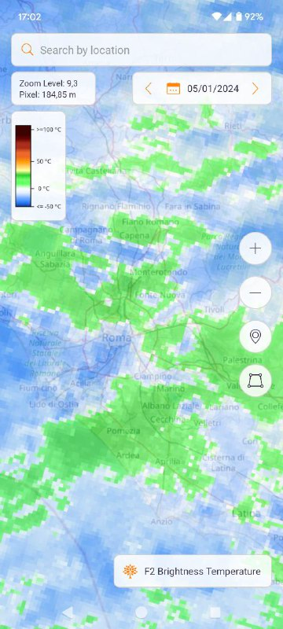

  

  
  

  
  

  
  

  
  

  
  

  
  

  
  

  
  

  
  

  
  

  
  

  
  

  
  

  
  

  
  

  
  

  
  

  
  

  
  

  
  

 **SEN4ALL User
Guide**

 Version
September 2023

  
  

  
  

  
  

  
  

  
  

#  Table of Contents

[Table of Contents 2](#__RefHeading___Toc957_4206090767)

[1. Introduction 3](#__RefHeading___Toc967_4206090767)

[2. Date filtering 3](#__RefHeading___Toc965_4206090767)

[3. Sentinel-1, Sentinel-2, Sentinel-3, Sentinel-5
4](#__RefHeading___Toc963_4206090767)

[3.1 Map area 5](#__RefHeading___Toc969_4206090767)

[3.2 Sentinel-1 layers 9](#__RefHeading___Toc977_4206090767)

[3.3 Sentinel-2 layers 12](#__RefHeading___Toc975_4206090767)

[3.4 Sentinel-3 layers
13](#__RefHeading___Toc971_4206090767)

[3.5 Sentinel-5 layers 14](#__RefHeading___Toc973_4206090767)

[4. Search location 18](#__RefHeading___Toc961_4206090767)

[5. Draw area 19](#__RefHeading___Toc959_4206090767)

1.  #  Introduction

  
  

EUSPACE4ALL is a mobile application that
serves the purpose of process and analyze different data from three main
Sentinel constellations (1, 2 and 5). For Sentinel-1, the app, allows
the analysis of crops, urban detection, quality of water and vegetation
index, for Sentinel-5 the quality of air and for Sentinel-2 the
Normalized Difference Vegetation Index (NDVI) values of a portion of
territory over time. In particular, the user can query the system for a
readily available NDVI visualization, and specify an area of interest,
by using the search function, either by the search bar or directly
moving the finger on the map. Furthermore, the user can manually set a
date, which will be used to constrain the analysis temporally. In
addition, the app allows the user to analyze Sentinel-5 world coverage
pre-computed images and corine data

All the app sections work exactly in the
same way.

  
  

2.  #  Date filtering

  
  

From the home section the user can
choose the date that will filter the data from the actual Sentinel
constellation selected. To achieve this the user has to select the new
date by interacting with the datepicker located in the upper section of
the screen (or using the arrow to navigate between the days and choose
the use case and the constellation in lower section of the screen. This
action will update the actual layer displayed on the map and also enable
the layer switcher that allow the navigation between all available
layers.

3.  #  Sentinel-1, Sentinel-2, Sentinel-3, Sentinel-5

  
  

The following procedures are the same
for Sentinel-1, Sentinel-2 and Sentinel-5.

**Figure 1: Main
Screen**

  
  

  
  

  
  

1.  ##  Map area

  
  

In the map area are displayed different
information and the user can use different interaction with the
application

  

  
  

  
  

In the map section the user can choose
different layers, based on the use case and sensor selected
before.

  
  

  
  

  
  

  
  

  
  

There are many different use
cases:

-   **LAND**: 

monitoring of land quality and
agriculture powered by Sentinel-1, Sentinel-2
sensors

  

  

 Figure 3 :
**LAND
Context**

  

  

  

  

  

  

-   **ATMOSPHERE** : 

monitoring of air quality powered by
Sentinel-5 sensor

  

Figure 4 :
**ATMOSPHERE**
Context

  

  

  

  

  

  

-   **MARINE**: 

monitoring of seas quality powered by
Sentinel-1 

  
  

Figure 5 :
**MARINE**
Context

  
  

The user can interact with the layers
and visualize them on the map simply selecting the “layer selection”
button on the right of the map.

  
  

  
  

2.  ##  Sentinel-1 layers

  
  

For Sentinel-1 are available 5 layers
computed in real-time on the map (IW-VV, IW-VH, Crop Monitoring, Urban
Area and Water Roughness)

  
  

  Figure
6 : **Layer
IW-VV**
   Figure
7 : **Layer
IW-VH**

  
  

  
  

  
  

Figure 8 : Layer
**WATER ROUGHNESS
**Figure 9 : Layer
**URBAN
DETECTION**

 

  
  

  
  

  
  

  
  

  
  

  
  

  
  

  
  

Figure 9 : Layer
**CROP
MONITORING**

  
  

  
  

  
  

  
  

  
  

  
  

3.  ##  Sentinel-2 layers

For Sentinel-2 are available 2 layers
computed in real-time on the map **NDVI** and
**Moisture**

   Figure
10 : **Layer
****NDVI **
Figure 11 :
**Layer
****Moisture**

  

  

  

  

  

  

  

  

  

  

4.  ##  Sentinel-3 layers

For Sentinel-3 are available 2 layers :
** F1 Brightness Temperature and F2
Brightness Temperature **

  
  

  
  

  
  

  
  

  
  

  
  

  
  

  
  

  
  

  
  

  
  

  
  

  
  

  
  

  
  

  
  

  
  

  
  

  
  

  
  

  
  

Figure 11 :
**F1 Brightness Temperature
**** **Figure
12** :
****F2 Brightness
Temperature**

  
  

  
  

  
  

  
  

  
  

5.  ##  Sentinel-5 layers

For Sentinel-5 are available 6 layers :
**Carbon Monoxide CO, Methane CH4,
Formaldehyde HCHO, Nitrogen Dioxide NO2, Ozone O3 and Sulphur Dioxide
SO2**

Figure 13 : Layer
**Carbon Monoxide CO
**Figure 14
:Layer **Methane CH4
**

  
  

  
  

  
  

  
  

  
  

 Figure 15 : Layer
**Formaldehyde HCHO
** Figure 16 : Layer
** Nitrogen Dioxide NO2
**

  
  

  
  

  
  

  
  

  
  

  
  

  
  

Figure 17 :
**Ozone O3 **
Figure 18 :
**Sulphur Dioxide
SO2**

  
  

  
  

  
  

  
  

  
  

  
  

  
  

  
  

Here is an example of the Sentinel-1
layer. In this case we are loading IW-VH images. In the top left of the
map there is a legend relative to the actual layer loaded on the
map

  
  

Figure 19 :
**Layer
IW-VH**

  
  

In the map section the available zoom
level is between 9.0 and 14.0 for all the constellations, but the layers
are visible only from 11.0 to 14.0. For zoom levels lower than this
value the actual layer loaded on the map will automatically become
invisible.

4.  #  Search location

  
  

By typing in the text field located in
the top section of the map area, the user can search for a specific
location and the map will land on that location automatically. This can
be also achieved by selecting the pin button on the right, but in this
case the map will land on the user’s actual location.

At the first launch the map will ask for
location permissions and in case the GPS is off, will ask the user to
activate it.

  Figure 20 : **Search Screen** Figure 21 : **Urban Detection for search
place**

  
  

  
  

5.  #  Draw area

  
  

With the layer selected, the draw
feature will activate. Using this function, users can draw a polygon on
the map according to their specific requirements. Tap the button to
start (Fig. 7), then tap two points on the screen to create the area
polygon (Figura 22 and Figure 23). 

<table width="602" data-cellpadding="7" data-cellspacing="0">
<tbody>
<tr class="odd" data-valign="top">
<td width="287" style="background: transparent; border: none; padding: 0cm">

Figure 22 <strong>Draw Button Active</strong>
</td>
<td width="287" style="background: transparent; border: none; padding: 0cm">

Figure 23 <strong>Draw Polygon</strong>

 

</td>
</tr>
</tbody>
</table>

Once created (Figure 24), user can
download a geo-tiff image containing the values of the satellite bands
related to the layer, the bounding box of the drawn polygon and the
date. The file is georeferenced and can be analyzed with geotiff image
analysis tools.

Figure
24 **Save or Delete Polygon**

**PAGE
\\\* MERGEFORMAT2**

  
  

